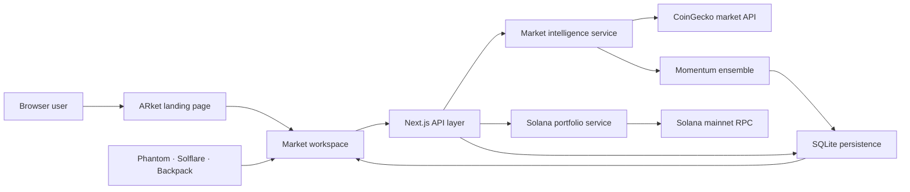

# Superteam Projects

A production-focused monorepo for products inspired by open ideas from the Superteam ecosystem. Each project is designed as a real, deployable application with working data flows, APIs, persistence, testing, and production packaging—not as a static interface prototype.

## Flagship project: ARket

ARket is an AI-assisted market-intelligence workspace for Solana DeFi. It translates live market data and public on-chain portfolio data into explainable forecasts, risk context, wallet-specific watchlists, and persistent price alerts.

The public landing experience explains the product before taking users into a complete intelligence workspace. Visitors can explore anonymously or connect Phantom, Solflare, or Backpack without giving ARket custody of their assets.

| Project | Status | Description | Application |
| --- | --- | --- | --- |
| [ARket](./apps/arket) | Operational | Live Solana forecasts, multi-wallet portfolios, isolated watchlists, alerts, and risk intelligence | `/` landing · `/app` workspace |

## The problem

DeFi operates continuously and is highly volatile. Users often have to combine price trackers, block explorers, portfolio applications, and alerting services before making even a basic market decision. Many prediction products also expose a result without explaining how it was produced.

ARket addresses four practical gaps:

1. **Fragmented information** — market prices, portfolio holdings, signals, and monitoring rules are brought into one workspace.
2. **Opaque predictions** — forecasts expose momentum, volatility, market structure, confidence, and risk instead of presenting an unexplained number.
3. **Weak personalization** — watchlists and alert rules are isolated by anonymous browser workspace or connected Solana public key.
4. **Custody risk** — portfolio analysis is read-only and never requires private keys or seed phrases.

## What is working

- Live prices, market capitalization, volume, and seven-day history from CoinGecko
- A resilient deterministic fallback feed when the upstream provider is unavailable
- Official token artwork for SOL, JUP, BONK, RAY, PYTH, and LINK
- Transparent 24-hour forecasts with direction, expected move, confidence, and annualized volatility
- Solana mainnet wallet inspection through JSON-RPC with provider failover
- Phantom, Solflare, and Backpack connection and disconnect flows
- Anonymous and wallet-scoped watchlists
- Persistent price alerts with pause, resume, trigger evaluation, and deletion
- Five-minute prediction snapshots for an auditable forecast history
- Responsive animated landing page and production dashboard
- Health monitoring, standalone Next.js output, Docker image, and persistent data volume

## System architecture



ARket uses one Next.js application for the public site, product workspace, and server API. This keeps deployment simple while maintaining clear service boundaries in `lib/` for future extraction into independent oracle or inference services.

## Prediction methodology

The current prediction engine is intentionally transparent. It is a deterministic momentum ensemble rather than a falsely labeled trained neural network. The model evaluates:

- multi-horizon price returns;
- short- and long-window exponential moving-average divergence;
- directional consistency across recent observations;
- annualized realized volatility;
- volatility damping to prevent unstable assets from producing exaggerated targets.

These factors produce a 24-hour forecast price, forecast percentage, confidence score, volatility estimate, and one of four directional signals: `Strong buy`, `Buy`, `Hold`, or `Sell`.

Predictions are experimental research outputs and are not financial advice. The service boundary is ready for a trained model or decentralized oracle implementation without requiring the product UI to be rewritten.

## Wallet and privacy model

ARket is non-custodial. Connecting a wallet shares its public address with the application; it does not expose a private key or seed phrase. Portfolio inspection reads public Solana mainnet state.

Anonymous users receive a randomly generated local workspace identifier. When a wallet is connected, watchlists and alerts switch to the wallet public key. All database queries are parameterized and scoped to that workspace identifier.

No transaction execution or automated trading is included. Adding those capabilities would require explicit transaction previews, wallet signatures, authorization controls, simulation, and additional security review.

## Technology

| Layer | Technology |
| --- | --- |
| Web application | Next.js 16, React 19, TypeScript 6 |
| Visualization | Recharts, Lucide, CSS 3D transforms and motion |
| Market data | CoinGecko markets API |
| Blockchain data | Solana JSON-RPC |
| Persistence | Node SQLite with WAL mode |
| Testing | Vitest, TypeScript, ESLint, production build validation |
| Deployment | Next.js standalone output, Docker, Docker Compose |

## Repository layout

```text
superteam-projects/
├── apps/
│   └── arket/
│       ├── app/                 # Pages and server API routes
│       ├── components/          # Landing and workspace interfaces
│       └── lib/                 # Market, prediction, portfolio, and storage services
├── Dockerfile                   # Production multi-stage container
├── docker-compose.yml           # Local production runtime and persistent volume
├── .env.example                 # Production environment template
└── package.json                 # Monorepo workspace commands
```

## Run locally

Requirements: Node.js 22 or newer and npm.

```bash
git clone https://github.com/TanmayJaiswal28/superteam-projects.git
cd superteam-projects
npm install
npm run dev
```

Open [http://localhost:3000](http://localhost:3000). The landing page is served from `/` and the application workspace from `/app`.

## Environment configuration

Copy `.env.example` to `.env`:

```bash
cp .env.example .env
```

| Variable | Required | Purpose |
| --- | --- | --- |
| `SOLANA_RPC_URL` | Recommended | Dedicated mainnet RPC for complete and reliable SPL-token discovery |
| `ARKET_DB_PATH` | Optional | Overrides the SQLite persistence location |

ARket can run without a dedicated RPC, but public providers may rate-limit token-account discovery. In that case the portfolio endpoint returns available SOL data and an explicit partial-data warning.

## API surface

| Method | Route | Purpose |
| --- | --- | --- |
| `GET` | `/api/markets` | Live market universe, forecasts, logos, and market pulse |
| `GET` | `/api/predictions/:symbol` | Current explainable prediction for one asset |
| `GET` | `/api/predictions/:symbol/history` | Persisted prediction snapshots |
| `GET · PUT · DELETE` | `/api/watchlist` | Workspace-scoped watchlist operations |
| `GET · POST` | `/api/alerts` | Evaluate and create workspace-scoped alerts |
| `PATCH · DELETE` | `/api/alerts/:id` | Pause, resume, or remove an alert |
| `GET` | `/api/portfolio/:address` | Read-only Solana portfolio inspection |
| `GET` | `/api/health` | Deployment health probe |

Watchlist and alert routes require an `owner` in the query or JSON body depending on the HTTP method. The product manages this automatically.

## Validation

```bash
npm run lint
npm run typecheck
npm run test
npm run build
```

The current suite covers prediction behavior, storage persistence and workspace isolation, Solana address validation, and production compilation.

## Production deployment

Run the production container locally:

```bash
docker compose up --build
```

The container:

- runs as a non-root user;
- exposes port `3000`;
- checks `/api/health` every 30 seconds;
- persists SQLite at `/app/apps/arket/.data`;
- uses Next.js standalone output for a smaller runtime image.

The same image can be deployed to Railway, Render, Fly.io, or another container platform with a persistent volume mounted at `/app/apps/arket/.data`.

## Roadmap

- Train and benchmark model variants against a documented holdout period
- Add authenticated signed-message sessions for stronger wallet ownership proof
- Expand token discovery with mint metadata and price coverage
- Add Pyth and Chainlink oracle adapters
- Publish a signed prediction feed for Solana programs
- Add notification delivery through email, Telegram, or web push
- Introduce model-performance dashboards and calibration monitoring
- Complete an external security review before transaction execution is considered

## Disclaimer

ARket is experimental market-research software. Forecasts can be wrong, market data can be delayed, and DeFi assets can lose substantial value. Nothing in this repository is investment, legal, or tax advice.
